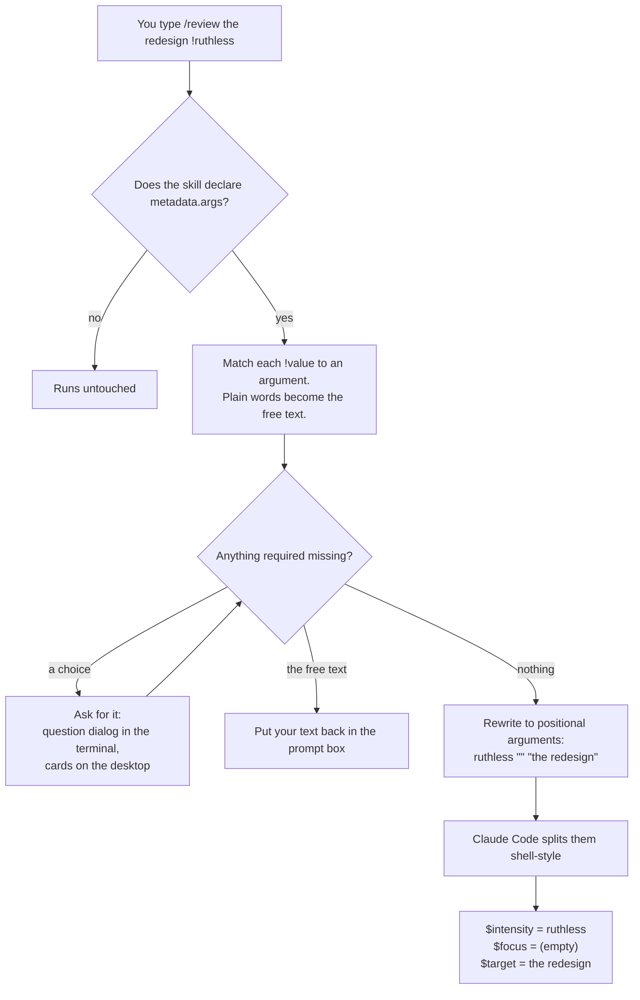

# claude-skill-args

A Claude Code mod that lets any skill you write offer a fixed set of choices as `!value` arguments. Users get autocomplete and clickable cards, and the skill gets clean, predictable arguments.

```
/demo !friendly the weather
```

## The idea

A skill normally gets one blob of free text and has to guess what the user meant:

```
/review be really harsh, mostly about scope, the onboarding redesign
```

With skill-args, you declare the choices once in your skill's frontmatter. Users pick them with `!value`, and your skill reads each one as its own argument:

```
/review !ruthless !scope the onboarding redesign
```

| | Without skill-args | With skill-args |
|---|---|---|
| User | Has to remember what the skill understands | Picks from autocomplete or cards |
| Missing input | The skill guesses or asks halfway through | Asked before the skill starts |
| Choices | Free-form and easy to misspell | Picked from a declared list |
| Skill body | Parses `$ARGUMENTS` itself | Reads `$intensity`, `$focus`, `$target` |

> [!TIP]
> Your skill body doesn't change. skill-args only rewrites what the user typed into the standard positional arguments that Claude Code already supports, so `$name`, `$0` and `$ARGUMENTS[0]` work as usual.

## Install

```
/plugin install skill-args --marketplace lfb0801/claude-skill-args
```

Answer `y` to add the marketplace, then choose a scope.

> [!NOTE]
> Run this in a terminal session. The desktop Code tab does not offer `/plugin`, but a user-scope install also loads there.

## Try the demo

[examples/demo/SKILL.md](examples/demo/SKILL.md) declares one choice (`tone`) and one free-text argument (`topic`), and echoes what it receives. It isn't installed as a command. To try it, copy it into your skills:

```bash
mkdir -p ~/.claude/skills/demo && cp examples/demo/SKILL.md ~/.claude/skills/demo/
```

Then type `/demo !friendly the weather`. Claude replies with:

```
tone=friendly topic=the weather
friendly | the weather
friendly "the weather"
```

Type `/demo the weather` without a tone and you are asked which tone you want before the skill runs.

## Use it in your own skill

Three things in the frontmatter turn it on:

```yaml
---
name: review
description: Review a piece of work
disable-model-invocation: true        # 1. only you can invoke it
arguments: [intensity, focus, target] # 2. the positional order
metadata:
  args:                               # 3. the choices
    intensity:
      question: How hard should it push?
      options:
        gentle: 🌱 Explore without much pressure
        ruthless: 🔥 Aggressively challenge every weakness
    focus:
      optional: true
      open: true
      options:
        scope: 🎯 Question what is in and what is out
        risks: 🚨 Hunt for what could go wrong
    target:
      question: What should be reviewed?
---

Review $target. Intensity: $intensity. Focus: $focus.
```

> [!IMPORTANT]
> The skill must set `disable-model-invocation: true`. skill-args runs when *you* type a slash command. It never sees a skill that Claude invokes on its own, so it only takes over skills that Claude can't invoke.

| Key under `metadata.args.<name>` | Meaning |
|---|---|
| `options` | The allowed values, each with a description. A leading emoji is shown on desktop cards. |
| `question` | What to ask when the value is missing. Defaults to `Which <name>?` |
| `optional: true` | Don't ask for it. A missing value reaches the skill as an empty string. |
| `open: true` | Also accept values that aren't in the list. |
| *(no `options`)* | The free-text argument: every plain word the user typed. At most one. |

Rules:

- `arguments:` sets the positional order and enables `$name`. Leave it out and the order of `metadata.args` is used; then use `$0`, `$1`, and so on.
- Every argument is required unless it sets `optional: true`.
- `!values` can be written anywhere after the command, in any order.
- An unknown `!value` fills the first empty open argument. If there is none, it counts as an invalid value for the first empty required strict argument, which is then asked again. Otherwise it stays in the free text.
- Prefer single-codepoint emoji in descriptions.
- Skills without `metadata.args` behave exactly as before.

### What the skill receives

| Typed | `$intensity` / `$0` | `$focus` / `$1` | `$target` / `$2` |
|---|---|---|---|
| `/review !ruthless !scope the redesign` | `ruthless` | `scope` | `the redesign` |
| `/review the redesign !gentle` | `gentle` | *(empty)* | `the redesign` |
| `/review !gentle !tone my notes` | `gentle` | `tone` *(open)* | `my notes` |
| `/review !gentle she said "it's done"` | `gentle` | *(empty)* | `she said "it's done"` |

> [!NOTE]
> `$ARGUMENTS` is the whole rewritten string, such as `ruthless scope "the redesign"`, not what the user typed. Use `$name` or `$N` for single values.

## How it works



Step by step:

1. **While you type**, it reads the skill's `metadata.args` and suggests the `!values` that are still open.
2. **When you submit**, it intercepts the command, matches every `!value`, and asks for anything required that's missing.
3. **Before the skill runs**, it rewrites your input to one quoted value per declared argument, with `""` for an empty optional one, so every position stays in place.
4. **Claude Code** then fills `$name`, `$N` and `$ARGUMENTS[N]` from that string, as it does for any skill.

## What it looks like

These wireframes use the review skill above.

**Terminal: autocomplete while typing**

```
> /review !r
  !ruthless    Aggressively challenge every weakness
  !risks       Hunt for what could go wrong
```

**Terminal: a required choice is missing on submit**

```
 ☐ intensity

 How hard should it push?

 ❯ 1. gentle — Explore without much pressure
   2. ruthless — Aggressively challenge every weakness
   3. Type something.

 Enter to select · Esc to cancel
```

An invalid answer is asked again. Esc cancels and puts your text back in the prompt.

**Desktop app: cards above the prompt while typing**

```
 How hard should it push? Click to add it, or type !gentle.
 ╭────────────────────────────────╮  ╭────────────────────────────────╮
 │ 🌱 gentle                      │  │ 🔥 ruthless                    │
 │ Explore without much pressure  │  │ Aggressively challenge every   │
 │                                │  │ weakness                       │
 ╰────────────────────────────────╯  ╰────────────────────────────────╯
 > /review the redesign
```

**Desktop app: a required choice is missing on submit**

```
 /review · How hard should it push?                              Cancel
 ╭────────────────────────────────╮  ╭────────────────────────────────╮
 │ 🌱 gentle                      │  │ 🔥 ruthless                    │
 ...
```

| | Terminal | Desktop app (Code tab) |
|---|---|---|
| Suggestions while typing | Native autocomplete rows for `!values`, after the command and after each completed value. A compact clickable list appears above the prompt when the native menu has nothing to show. | No native autocomplete exists there. A band of clickable cards follows what you type, including Tab completion. |
| Missing required value on submit | Asked through Claude's own question dialog. | Picked from cards. |
| Missing free text on submit | Your text is put back in the prompt box. | Your text is put back in the prompt box. |

## Where skill files are found

- Namespaced `plugin:name`: through the plugin's own root, or its `installPath` in `~/.claude/plugins/installed_plugins.json`.
- Plain names: through Claude's command list, then `.claude/skills/<name>/SKILL.md`, then `~/.claude/skills/<name>/SKILL.md`.

If the hook fails before it has read a skill's definition, the command runs untouched. If it fails after that, it refuses to run the command.

## Requirements

- Verified on Claude Code 2.1.293.

> [!WARNING]
> Function hooks (`modules` in `hooks/hooks.json`) are early access and may change. Older CLIs ignore the module, or reject `hooks.json` outright.

## Limitations

- The desktop app never calls the autocomplete hook, so the desktop uses cards instead.
- A band cannot take keyboard focus without ctrl+x tab, so keyboard selection goes through native autocomplete or the question dialog.
- Plugin skills are located through `~/.claude/plugins/installed_plugins.json`, an internal file whose format may change.
- On the desktop the prompt is read once every 500ms, which is how Tab completion is noticed.

> [!CAUTION]
> Install only one copy of this feature. A plugin that bundles its own copy, installed alongside this mod, would handle the same skill twice.

## Development

```
claude --plugin-dir .
claude plugin validate .
claude plugin test .
tsc -p .
```

`tsc` needs `.claude-plugin/types/`, which Claude Code generates when it loads the mod. It is gitignored.
